# Praktikum Modul 5 Jarkom

|Nama anggota|NRP|
|---|---|
| Tasya Aulia Darmawan | 5027241009|
| Ahmad Rafi F D | 5027241068|

## Misi 1: Memetakan Medan Perang
Topologi:

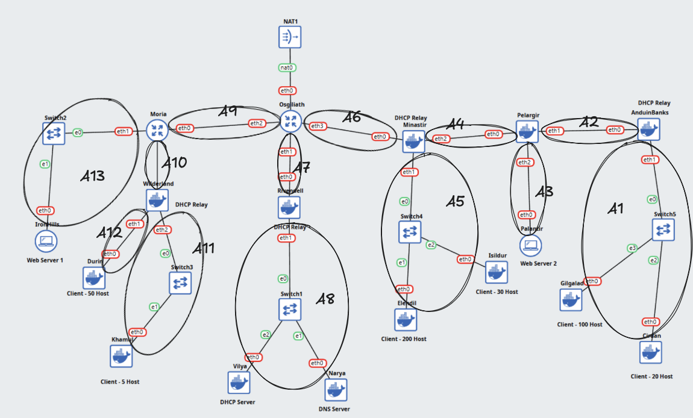

Note:
- Narya: Berfungsi sebagai DNS Server.
- Vilya: Berfungsi sebagai DHCP Server.
- Web Servers: Palantir  dan IronHills.
- Client (Pasukan):
  
a) Khamul: 5 host (Target/Burnice).

b) Cirdan: 20 host (Lycaon).

c) Isildur: 30 host (Policeboo).

d) Durin: 50 host (Caesar).

e) Gilgalad: 100 host (Ellen).

f) Elendil: 200 host (Jane).

### A. Subnet
|Subnet|Jumlah IP|Netmask|
|---|---|---|
| A1 | 121 | 255.255.255.128 |
| A2 | 2 | 255.255.255.252 |
| A3 | 2 | 255.255.255.252 |
| A4 | 2 | 255.255.255.252 |
| A5 | 231 | 255.255.255.0 |
| A6 | 2 | 255.255.255.252 |
| A7 | 2 | 255.255.255.252 |
| A8 | 3 | 255.255.255.248 |
| A9 | 2 | 255.255.255.252 |
| A10 | 2 | 255.255.255.252 |
| A11 | 6 | 255.255.255.248 |
| A12 | 51 | 255.255.255.192 |
| A13 | 2 | 255.255.255.252 |
| Total | 428 | = /23 |

### B. VLSM & Pohon Subnet

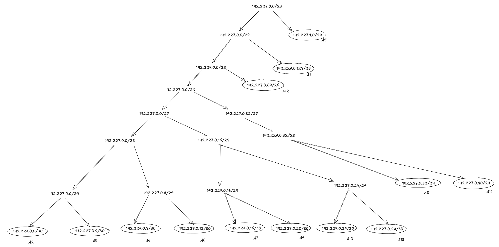

|Subnet|Prefix|Network ID|Range IP|Broadcast|Netmask|
|---|---|---|---|---|---|
| A1 | /25 | 192.227.0.128 | 192.227.0.129 - 192.227.0.254 | 192.227.0.255 | 255.255.255.128 |
| A2 | /30 | 192.227.0.0 | 192.227.0.1 - 192.227.0.2 | 192.227.0.3 | 255.255.255.252 |
| A3 | /30 | 192.227.0.4 | 192.227.0.5 - 192.227.0.6 | 192.227.0.7 | 255.255.255.252 |
| A4 | /30 | 192.227.0.8 | 192.227.0.9 - 192.227.0.10 | 192.227.0.11 | 255.255.255.252 |
| A5 | /24 | 192.227.1.0 | 192.227.1.1 - 192.227.1.254 | 192.227.1.255 | 255.255.255.0 |
| A6 | /30 | 192.227.0.12 | 192.227.0.13 - 192.227.0.14 | 192.227.0.15 | 255.255.255.252 |
| A7 | /30 | 192.227.0.16 | 192.227.0.17 - 192.227.0.18 | 192.227.0.19 | 255.255.255.252 |
| A8 | /29 | 192.227.0.32 | 192.227.0.33 - 192.227.0.38 |  192.227.0.39 | 255.255.255.248 |
| A9 | /30 | 192.227.0.20 | 192.227.0.21 - 192.227.0.22 | 192.227.0.23 | 255.255.255.252 |
| A10 | /30 | 192.227.0.24 | 192.227.0.25 - 192.227.0.26 | 192.227.0.27 | 255.255.255.252 |
| A11 | /29 | 192.227.0.40 | 192.227.0.41 - 192.227.0.46 | 192.227.0.47 | 255.255.255.248 |
| A12 | /26 | 192.227.0.64 | 192.227.0.65 - 192.227.0.126 | 192.227.0.127 | 255.255.255.192 |
| A13 | /30 | 192.227.0.28 | 192.227.0.29 - 192.227.0.30 | 192.227.0.31 | 255.255.255.252 |

### C. Konfigurasi
### Hosts

#### a. Cirdan.sh
```
#!/bin/bash
# Client Cirdan (Elf)

auto eth0
iface eth0 inet static
    address 192.227.0.131
    netmask 255.255.255.128
    gateway 192.227.0.129
    dns-nameservers 192.227.0.35

# CLI Runtime
up ip addr flush dev eth0
up ip addr add 192.227.0.131/25 dev eth0
up ip link set eth0 up
up ip route add default via 192.227.0.129
up echo 'nameserver 192.227.0.35' > /etc/resolv.conf
up echo '[Cirdan Ready]'
```

#### b. Durin.sh
```
#!/bin/bash
# Client Durin (Dwarf)

auto eth0
iface eth0 inet static
    address 192.227.0.66
    netmask 255.255.255.192
    gateway 192.227.0.65
    dns-nameservers 192.227.0.35

# CLI Runtime
up ip addr flush dev eth0
up ip addr add 192.227.0.66/26 dev eth0
up ip link set eth0 up
up ip route add default via 192.227.0.65
up echo 'nameserver 192.227.0.35' > /etc/resolv.conf
up echo '[Durin Ready]'
```
#### c. Elendil.sh
```
#!/bin/bash
# Client Elendil (Human)

auto eth0
iface eth0 inet static
    address 192.227.1.2
    netmask 255.255.255.0
    gateway 192.227.1.1
    dns-nameservers 192.227.0.35

# CLI Runtime
up ip addr flush dev eth0
up ip addr add 192.227.1.2/24 dev eth0
up ip link set eth0 up
up ip route add default via 192.227.1.1
up echo 'nameserver 192.227.0.35' > /etc/resolv.conf
up echo '[Elendil Ready]'
```
#### d. Gilgalad.sh
```
#!/bin/bash
# Client Gilgalad (Elf)

auto eth0
iface eth0 inet static
    address 192.227.0.130
    netmask 255.255.255.128
    gateway 192.227.0.129
    dns-nameservers 192.227.0.35

# CLI Runtime
up ip addr flush dev eth0
up ip addr add 192.227.0.130/25 dev eth0
up ip link set eth0 up
up ip route add default via 192.227.0.129
up echo 'nameserver 192.227.0.35' > /etc/resolv.conf
up echo '[Gilgalad Ready]'
```
#### e. Isildur.sh
```
#!/bin/bash
# Client Isildur (Human - Subnet A5)

# --- CONFIG PERMANEN ---
auto eth0
iface eth0 inet static
    address 192.227.1.3
    netmask 255.255.255.0
    gateway 192.227.1.1
    dns-nameservers 192.227.0.35

# --- CLI RUNTIME ---
# Reset IP & Set Static
up ip addr flush dev eth0
up ip addr add 192.227.1.3/24 dev eth0
up ip link set eth0 up
up ip route add default via 192.227.1.1
up echo 'nameserver 192.227.0.35' > /etc/resolv.conf
up echo '[Isildur Ready]'
```
#### f. Khamul.sh
```
#!/bin/bash
# Client Khamul (Nazgul)

auto eth0
iface eth0 inet static
    address 192.227.0.42
    netmask 255.255.255.248
    gateway 192.227.0.41
    dns-nameservers 192.227.0.35

# CLI Runtime
up ip addr flush dev eth0
up ip addr add 192.227.0.42/29 dev eth0
up ip link set eth0 up
up ip route add default via 192.227.0.41
up echo 'nameserver 192.227.0.35' > /etc/resolv.conf
up echo '[Khamul Ready]'
```
### Server
#### a. IronHills.sh
```
#!/bin/bash
# Server IronHills

auto eth0
iface eth0 inet static
    address 192.227.0.30
    netmask 255.255.255.252
    gateway 192.227.0.29
    dns-nameservers 192.227.0.35

# CLI Runtime
up ip addr flush dev eth0
up ip addr add 192.227.0.30/30 dev eth0
up ip link set eth0 up
up ip route add default via 192.227.0.29
up echo 'nameserver 192.227.0.35' > /etc/resolv.conf
up echo '[IronHills Ready]'
```
#### b. Narya.sh
```
#!/bin/bash
# Server Narya

auto eth0
iface eth0 inet static
    address 192.227.0.35
    netmask 255.255.255.248
    gateway 192.227.0.33
    dns-nameservers 192.168.122.1

# CLI Runtime
up ip addr flush dev eth0
up ip addr add 192.227.0.35/29 dev eth0
up ip link set eth0 up
up ip route add default via 192.227.0.33
up echo 'nameserver 192.168.122.1' > /etc/resolv.conf
up echo '[Narya Ready]'
```
#### c. Palantir.sh
```
#!/bin/bash
# Server Palantir

auto eth0
iface eth0 inet static
    address 192.227.0.6
    netmask 255.255.255.252
    gateway 192.227.0.5
    dns-nameservers 192.227.0.35

# CLI Runtime
up ip addr flush dev eth0
up ip addr add 192.227.0.6/30 dev eth0
up ip link set eth0 up
up ip route add default via 192.227.0.5
up echo 'nameserver 192.227.0.35' > /etc/resolv.conf
up echo '[Palantir Ready]'
```
#### d. Vilya.sh
```
#!/bin/bash
# Server Vilya

auto eth0
iface eth0 inet static
    address 192.227.0.34
    netmask 255.255.255.248
    gateway 192.227.0.33
    dns-nameservers 192.227.0.35

# CLI Runtime
up ip addr flush dev eth0
up ip addr add 192.227.0.34/29 dev eth0
up ip link set eth0 up
up ip route add default via 192.227.0.33
up echo 'nameserver 192.227.0.35' > /etc/resolv.conf
up echo '[Vilya Ready]'
```
### AnduinBanks.sh
```
#!/bin/bash
# Router AnduinBanks

# ETH0: Ke Pelargir (A2)
auto eth0
iface eth0 inet static
    address 192.227.0.2
    netmask 255.255.255.252
    gateway 192.227.0.1

# ETH1: Ke Client Gilgalad/Cirdan (A1)
auto eth1
iface eth1 inet static
    address 192.227.0.129
    netmask 255.255.255.128

# --- CLI Runtime ---
up echo 1 > /proc/sys/net/ipv4/ip_forward

up ip addr flush dev eth0
up ip addr add 192.227.0.2/30 dev eth0
up ip link set eth0 up

up ip addr flush dev eth1
up ip addr add 192.227.0.129/25 dev eth1
up ip link set eth1 up

# Default Route ke Pelargir
up ip route add default via 192.227.0.1

up echo '[AnduinBanks Ready]'
```
### Minastir.sh
```
#!/bin/bash
# Router Minastir

# ETH0: Ke Osgiliath (A6)
auto eth0
iface eth0 inet static
    address 192.227.0.14
    netmask 255.255.255.252
    gateway 192.227.0.13

# ETH1: Ke Pelargir (A4)
auto eth1
iface eth1 inet static
    address 192.227.0.9
    netmask 255.255.255.252

# ETH2: Ke Client Elendil/Isildur (A5)
auto eth2
iface eth2 inet static
    address 192.227.1.1
    netmask 255.255.255.0

# --- CLI Runtime ---
up echo 1 > /proc/sys/net/ipv4/ip_forward

up ip addr flush dev eth0
up ip addr add 192.227.0.14/30 dev eth0
up ip link set eth0 up

up ip addr flush dev eth1
up ip addr add 192.227.0.9/30 dev eth1
up ip link set eth1 up

up ip addr flush dev eth2
up ip addr add 192.227.1.1/24 dev eth2
up ip link set eth2 up

# Default Route ke Osgiliath
up ip route add default via 192.227.0.13

# Route ke Bawah (Arah Pelargir)
# Via 192.227.0.10 (IP Pelargir di A4)
up ip route add 192.227.0.128/25 via 192.227.0.10 # A1
up ip route add 192.227.0.0/30 via 192.227.0.10   # A2
up ip route add 192.227.0.4/30 via 192.227.0.10   # A3

up echo '[Minastir Ready]'
```
### Moria.sh
```
#!/bin/bash
# Router Moria

# ETH0: Ke Osgiliath (A9)
auto eth0
iface eth0 inet static
    address 192.227.0.22
    netmask 255.255.255.252
    gateway 192.227.0.21

# ETH1: Ke Wilderland (A10)
auto eth1
iface eth1 inet static
    address 192.227.0.25
    netmask 255.255.255.252

# ETH2: Ke IronHills (A13)
auto eth2
iface eth2 inet static
    address 192.227.0.29
    netmask 255.255.255.252

# --- CLI Runtime ---
up echo 1 > /proc/sys/net/ipv4/ip_forward

up ip addr flush dev eth0
up ip addr add 192.227.0.22/30 dev eth0
up ip link set eth0 up

up ip addr flush dev eth1
up ip addr add 192.227.0.25/30 dev eth1
up ip link set eth1 up

up ip addr flush dev eth2
up ip addr add 192.227.0.29/30 dev eth2
up ip link set eth2 up

# Default Route ke Osgiliath
up ip route add default via 192.227.0.21

# Route ke Bawah (Wilderland Clients)
# Via 192.227.0.26 (IP Wilderland di A10)
up ip route add 192.227.0.40/29 via 192.227.0.26 # A11 (Khamul)
up ip route add 192.227.0.64/26 via 192.227.0.26 # A12 (Durin)

up echo '[Moria Ready]'
```
### Osgiliath.sh
```
#!/bin/bash
# Router Osgiliath - Pusat

# --- CONFIG PERMANEN (/etc/network/interfaces) ---
# ETH0: Ke Internet (Valinor)
auto eth0
iface eth0 inet static
    address 192.168.122.100
    netmask 255.255.255.0
    gateway 192.168.122.1

# ETH1: Ke Minastir (A6)
auto eth1
iface eth1 inet static
    address 192.227.0.13
    netmask 255.255.255.252

# ETH2: Ke Rivendell (A7)
auto eth2
iface eth2 inet static
    address 192.227.0.17
    netmask 255.255.255.252

# ETH3: Ke Moria (A9)
auto eth3
iface eth3 inet static
    address 192.227.0.21
    netmask 255.255.255.252

# --- CLI INTERFACE (Runtime) ---
up echo 1 > /proc/sys/net/ipv4/ip_forward

# Up ETH0 (Internet)
up ip addr flush dev eth0
up ip addr add 192.168.122.100/24 dev eth0
up ip link set eth0 up

# Up ETH1 (Ke Minastir)
up ip addr flush dev eth1
up ip addr add 192.227.0.13/30 dev eth1
up ip link set eth1 up

# Up ETH2 (Ke Rivendell)
up ip addr flush dev eth2
up ip addr add 192.227.0.17/30 dev eth2
up ip link set eth2 up

# Up ETH3 (Ke Moria)
up ip addr flush dev eth3
up ip addr add 192.227.0.21/30 dev eth3
up ip link set eth3 up

# --- ROUTING ---

# 1. Route ke Area MINASTIR (A1, A2, A3, A4, A5)
# Via 192.227.0.14 (IP Minastir di A6)
up ip route add 192.227.1.0/24 via 192.227.0.14   # A5 (Elendil)
up ip route add 192.227.0.128/25 via 192.227.0.14 # A1 (Gilgalad)
up ip route add 192.227.0.0/30 via 192.227.0.14   # A2 (Link Pelargir-Anduin)
up ip route add 192.227.0.4/30 via 192.227.0.14   # A3 (Link Pelargir-Palantir)
up ip route add 192.227.0.8/30 via 192.227.0.14   # A4 (Link Minastir-Pelargir)
# 2. Route ke Area RIVENDELL (A8)
# Via 192.227.0.18 (IP Rivendell di A7)
up ip route add 192.227.0.32/29 via 192.227.0.18  # A8 (Server Narya/Vilya)

# 3. Route ke Area MORIA (A10, A11, A12, A13)
# Via 192.227.0.22 (IP Moria di A9)
up ip route add 192.227.0.24/30 via 192.227.0.22  # A10 (Link Moria-Wilderland)
up ip route add 192.227.0.40/29 via 192.227.0.22  # A11 (Khamul)
up ip route add 192.227.0.64/26 via 192.227.0.22  # A12 (Durin)
up ip route add 192.227.0.28/30 via 192.227.0.22  # A13 (IronHills)

# 4. Default Route ke Internet (Valinor)
up ip route add default via 192.168.122.1
```

## MISI 2: SECURITY (NAT SNAT - NO MASQUERADE)
### Mengubah source IP paket keluar menjadi IP Osgiliath (192.168.122.100)
```
up iptables -t nat -A POSTROUTING -o eth0 -j SNAT --to-source 192.168.122.100

up echo '[Osgiliath Ready]'
```

### Pelargir.sh

```
#!/bin/bash
# Router Pelargir

# ETH0: Ke Minastir (A4)
auto eth0
iface eth0 inet static
    address 192.227.0.10
    netmask 255.255.255.252
    gateway 192.227.0.9

# ETH1: Ke AnduinBanks (A2)
auto eth1
iface eth1 inet static
    address 192.227.0.1
    netmask 255.255.255.252

# ETH2: Ke Palantir (A3)
auto eth2
iface eth2 inet static
    address 192.227.0.5
    netmask 255.255.255.252

# --- CLI Runtime ---
up echo 1 > /proc/sys/net/ipv4/ip_forward

up ip addr flush dev eth0
up ip addr add 192.227.0.10/30 dev eth0
up ip link set eth0 up

up ip addr flush dev eth1
up ip addr add 192.227.0.1/30 dev eth1
up ip link set eth1 up

up ip addr flush dev eth2
up ip addr add 192.227.0.5/30 dev eth2
up ip link set eth2 up

# Default Route ke Minastir
up ip route add default via 192.227.0.9

# Route ke Bawah (A1 - Gilgalad) via AnduinBanks
up ip route add 192.227.0.128/25 via 192.227.0.2

up echo '[Pelargir Ready]'
```
### Rivendell.sh
```
#!/bin/bash
# Router Rivendell

# ETH0: Ke Osgiliath (A7)
auto eth0
iface eth0 inet static
    address 192.227.0.18
    netmask 255.255.255.252
    gateway 192.227.0.17

# ETH1: Ke Server Narya/Vilya (A8)
auto eth1
iface eth1 inet static
    address 192.227.0.33
    netmask 255.255.255.248

# --- CLI Runtime ---
up echo 1 > /proc/sys/net/ipv4/ip_forward

up ip addr flush dev eth0
up ip addr add 192.227.0.18/30 dev eth0
up ip link set eth0 up

up ip addr flush dev eth1
up ip addr add 192.227.0.33/29 dev eth1
up ip link set eth1 up

# Default Route ke Osgiliath
up ip route add default via 192.227.0.17

up echo '[Rivendell Ready]'
```
### Wilderland.sh
```
#!/bin/bash
# Router Wilderland

# ETH0: Ke Moria (A10)
auto eth0
iface eth0 inet static
    address 192.227.0.26
    netmask 255.255.255.252
    gateway 192.227.0.25

# ETH1: Ke Khamul (A11)
auto eth1
iface eth1 inet static
    address 192.227.0.41
    netmask 255.255.255.248

# ETH2: Ke Durin (A12)
auto eth2
iface eth2 inet static
    address 192.227.0.65
    netmask 255.255.255.192

# --- CLI Runtime ---
up echo 1 > /proc/sys/net/ipv4/ip_forward

up ip addr flush dev eth0
up ip addr add 192.227.0.26/30 dev eth0
up ip link set eth0 up

up ip addr flush dev eth1
up ip addr add 192.227.0.41/29 dev eth1
up ip link set eth1 up

up ip addr flush dev eth2
up ip addr add 192.227.0.65/26 dev eth2
up ip link set eth2 up

# Default Route ke Moria
up ip route add default via 192.227.0.25

up echo '[Wilderland Ready]'
```
### D. Konfigurasi Service (setelah misi 2, no 1(di atas))
In Narya:
#### 1. Install Bind9
```
apt-get update
apt-get install bind9 -y
```
#### 2. Masukkan Konfigurasi Forwarder (Agar Narya tanya ke Google kalau dia gak tau)
```
nano /etc/bind/named.conf.options
options {
        directory "/var/cache/bind";
        forwarders {
                8.8.8.8;
        };
        allow-query { any; };
        dnssec-validation auto;
        auth-nxdomain no;
        listen-on-v6 { any; };
};
```
#### 3. Restart Service DNS
```service bind9 restart / /usr/sbin/named -u bind```

in Vilya:
```
apt-get update
apt-get install isc-dhcp-server -y

nano /etc/dhcp/dhcpd.conf
```
#### Konfigurasi Global
```
default-lease-time 600;
max-lease-time 7200;
option domain-name-servers 192.227.0.35; # IP Narya
```

a) Subnet A8 (Jaringan Vilya sendiri) - Wajib ada meski kosong
```
subnet 192.227.0.32 netmask 255.255.255.248 {
}
```
b) Subnet A1 (Gilgalad & Cirdan) - Prefix /25
```
subnet 192.227.0.128 netmask 255.255.255.128 {
    range 192.227.0.132 192.227.0.254;
    option routers 192.227.0.129;
    option broadcast-address 192.227.0.255;
}
```
c) Subnet A5 (Elendil & Isildur) - Prefix /24
```
subnet 192.227.1.0 netmask 255.255.255.0 {
    range 192.227.1.10 192.227.1.254;
    option routers 192.227.1.1;
    option broadcast-address 192.227.1.255;
}
```
d) Subnet A11 (Khamul) - Prefix /29
```
subnet 192.227.0.40 netmask 255.255.255.248 {
    range 192.227.0.43 192.227.0.46;
    option routers 192.227.0.41;
    option broadcast-address 192.227.0.47;
}
```
e) Subnet A12 (Durin) - Prefix /26
```
subnet 192.227.0.64 netmask 255.255.255.192 {
    range 192.227.0.67 192.227.0.126;
    option routers 192.227.0.65;
    option broadcast-address 192.227.0.127;
}

sed -i 's/INTERFACESv4=""/INTERFACESv4="eth0"/' /etc/default/isc-dhcp-server

service isc-dhcp-server restart
```

in Palantir and IronHills:
```
apt-get update
apt-get install nginx -y
```

in Palantir:
```
echo "Welcome to Palantir" > /var/www/html/index.html
service nginx restart
```

in IronHills:
```
echo "Welcome to IronHills" > /var/www/html/index.html
service nginx restart
```

in Relay Nodes (Minastir, AnduinBanks, Rivendell, Wilderland):
```
echo "nameserver 192.227.0.35" > /etc/resolv.conf

apt-get update
apt-get install isc-dhcp-relay -y

nano /etc/default/isc-dhcp-relay
```
in Minastir and Wilderland:
```
SERVERS="192.227.0.34"
INTERFACES="eth0 eth1 eth2"
OPTIONS=""
```

in AnduinBanks and Rivendell:
```
SERVERS="192.227.0.34"
INTERFACES="eth0 eth1"
OPTIONS=""

echo 1 > /proc/sys/net/ipv4/ip_forward
service isc-dhcp-relay restart
```

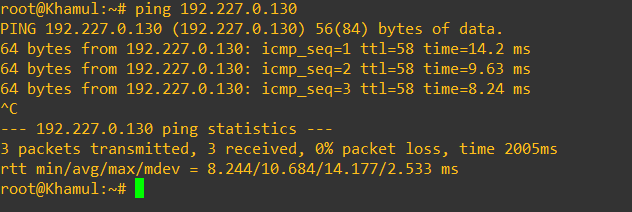

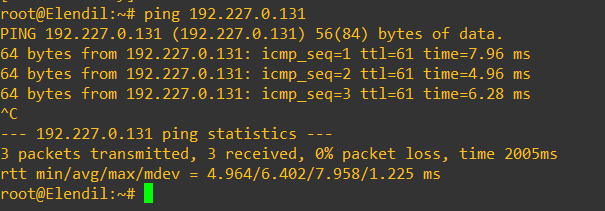

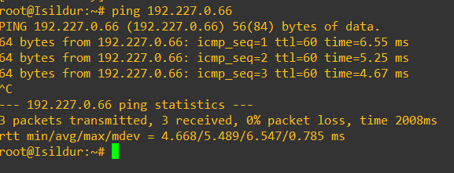

## Misi 2: Menemukan Jejak Kegelapan (Security Rules)
### Soal 2:
Memblokir PING ke Vilya
Penjelasan:

-A INPUT : Menambahkan aturan ke chain INPUT (paket yang masuk ke Vilya)

-p icmp  : Protokol ICMP

--icmp-type echo-request : Khusus tipe permintaan ping (ping request)

-j DROP  : Buang paketnya (jangan dibalas)

```iptables -A INPUT -p icmp --icmp-type echo-request -j DROP```
Testing:
a) Dari Elendil coba ping Vilya
```ping 192.227.0.34 -c 3```

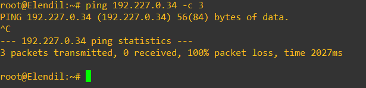

b) Dari Vilya coba ping Elendil
```ping 192.227.1.2 -c 3```

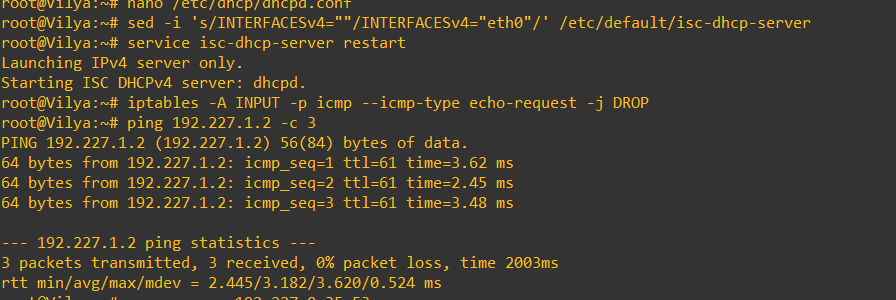

### Soal 3:
Memastikan hanya Vilya yang dapat mengakses Narya (DNS Server).
In Narya:
1. Izinkan Vilya (192.227.0.34) mengakses port 53 (UDP & TCP)
```
iptables -A INPUT -s 192.227.0.34 -p udp --dport 53 -j ACCEPT
iptables -A INPUT -s 192.227.0.34 -p tcp --dport 53 -j ACCEPT
```
2. Blokir semua akses lain ke port 53
```
iptables -A INPUT -p udp --dport 53 -j DROP
iptables -A INPUT -p tcp --dport 53 -j DROP
```
After testing:
#### Hapus semua aturan di Narya (Flush)
```
iptables -F
```
Testing:
a) From Vilya
Cek koneksi ke port 53 UDP Narya
```nc -z -v -u 192.227.0.35 53```


It should be: Connection to 192.227.0.35 53 port [udp/domain] succeeded!

b) From Elendil
```apt-get update```

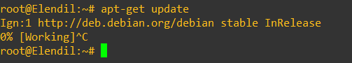

It should be cant access to DNS (Narya).

### Soal 4:
Mengatur aturan akses berbasis waktu (time-based access).
In IronHills:
#### 1. Set waktu ke hari Rabu (Wednesday)
--> Go to windows settings, change the day to 29/11/2023.

Verifikasi
```date```
#### 2. Izinkan Akses HTTP (Port 80) HANYA pada Sabtu & Minggu UNTUK Subnet tertentu

a) Subnet Durin (A12)

```iptables -A INPUT -p tcp --dport 80 -s 192.227.0.64/26 -m time --weekdays Sat,Sun -j ACCEPT```

b) Subnet Khamul (A11)

```iptables -A INPUT -p tcp --dport 80 -s 192.227.0.40/29 -m time --weekdays Sat,Sun -j ACCEPT```

c) Subnet Elendil & Isildur (A5)

```iptables -A INPUT -p tcp --dport 80 -s 192.227.1.0/24 -m time --weekdays Sat,Sun -j ACCEPT```

#### 3. Blokir sisa akses ke Port 80 (Yang bukan weekend atau bukan IP di atas)

```iptables -A INPUT -p tcp --dport 80 -j DROP```

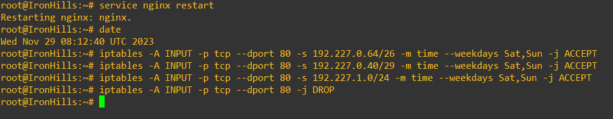

#### It Should Be in This Order

Testing:

- From elendil:
  
a) Coba akses web server
```curl 192.227.0.30 --connect-timeout 5```

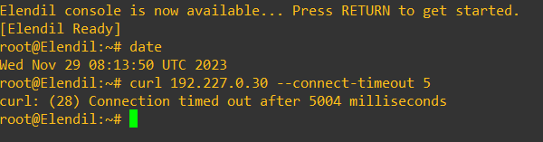

b) Then, change ur date again to now (weekday):
Go to windows settings, change the day to 29/11/2025.

```iptables -F```
Put the iptables again. In Order.

```service nginx restart```

Test again from elendil.


### Soal 5:

Membatasi akses ke server Palantir berdasarkan waktu dan faksi. 
- Faksi Elf (Gilgalad & Cirdan): Hanya boleh mengakses server Palantir antara jam 07.00 - 15.00.
- Faksi Manusia (Elendil & Isildur): Hanya boleh mengakses server Palantir antara jam 17.00 - 23.00.

In Palantir:

#### 1. Bersihkan aturan lama

```iptables -F```

#### 2. Aturan untuk FAKSI ELF (Gilgalad & Cirdan - Subnet A1: 192.227.0.128/25)

Hanya boleh jam 07:00 - 15:00

```iptables -A INPUT -p tcp --dport 80 -s 192.227.0.128/25 -m time --timestart 07:00 --timestop 15:00 -j ACCEPT```

#### 3. Aturan untuk FAKSI MANUSIA (Elendil & Isildur - Subnet A5: 192.227.1.0/24)

Hanya boleh jam 17:00 - 23:00

```iptables -A INPUT -p tcp --dport 80 -s 192.227.1.0/24 -m time --timestart 17:00 --timestop 23:00 -j ACCEPT```

#### 4. Blokir sisanya (Semua akses port 80 yang tidak sesuai kriteria di atas)

```iptables -A INPUT -p tcp --dport 80 -j DROP```

#### 5. Pastikan Nginx jalan

```service nginx restart```

Testing:

From gilgalad (elf):

a) Cek jam dulu (optional, buat memastikan)

```date```

b) Akses Palantir | Hanya boleh jam 07:00 - 15:00

```curl 192.227.0.6 or curl 192.227.0.6 --connect-timeout 5```

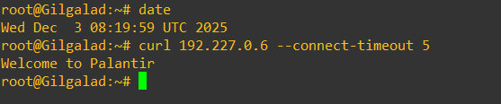

From elendil (manusia):

a) Cek jam dulu (optional, buat memastikan)

```date```

b) Akses Palantir | Hanya boleh jam 17:00 - 23:00

```curl 192.227.0.6 or curl 192.227.0.6 --connect-timeout 5```

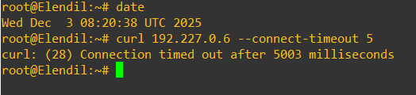

### Soal 6:

a. Web server harus memblokir scan port yang melebihi 15 port dalam waktu 20 detik.

b. Penyerang yang terblokir tidak dapat melakukan ping, nc, atau curl ke Palantir.

c. Catat log iptables dengan prefix "PORT_SCAN_DETECTED".

In Elendil:
```
apt-get update
apt-get install nmap -y
```

In Palantir:
1. Reset aturan lama agar bersih
```
iptables -F
iptables -X
```

2. Buat Chain Khusus untuk menghukum Scanner

Chain ini tugasnya: Catat Log -> Masukkan IP ke Blacklist -> Drop Paket
```
iptables -N KILL_SCANNER
iptables -A KILL_SCANNER -j LOG --log-prefix "PORT_SCAN_DETECTED " --log-level 4
iptables -A KILL_SCANNER -m recent --set --name BLACKLIST --rsource
iptables -A KILL_SCANNER -j DROP
```

3. Rule Utama (INPUT CHAIN)

a) Cek Blacklist (Satpam Pintu Depan)

Kalau IP penyerang sudah ada di daftar 'BLACKLIST' (kena ban dalam 60 detik terakhir), tolak SEMUANYA.
```iptables -A INPUT -m recent --update --seconds 60 --name BLACKLIST --rsource -j DROP```

b) Deteksi Port Scan (CCTV Penghitung)

Setiap ada paket TCP SYN (awal koneksi) masuk...
```iptables -A INPUT -p tcp --syn -m recent --set --name POTENTIAL_SCAN --rsource```

Cek apakah IP ini sudah mengirim lebih dari 15 paket dalam 20 detik terakhir?

a) Jika YA, lempar ke chain KILL_SCANNER
```iptables -A INPUT -p tcp --syn -m recent --update --seconds 20 --hitcount 15 --name POTENTIAL_SCAN --rsource -j KILL_SCANNER```

b) (Optional) Pastikan Nginx tetap nyala untuk traffic normal
```service nginx restart```

Testing:

In Elendil:

```ping 192.227.0.6 -c 3```
Has to be reply

Now do the REAL test:
```nmap -p 1-100 192.227.0.6```

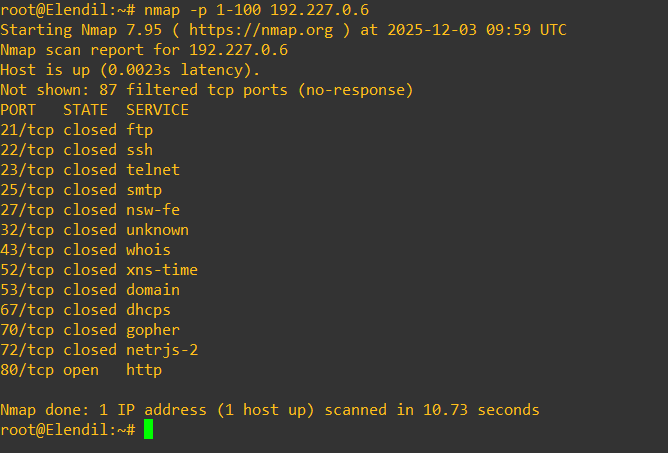

after that, try:

a) Coba Ping (Harus Gagal)
```ping 192.227.0.6 -c 3```

b) Coba Curl (Harus Gagal)
```curl 192.227.0.6 --connect-timeout 5```

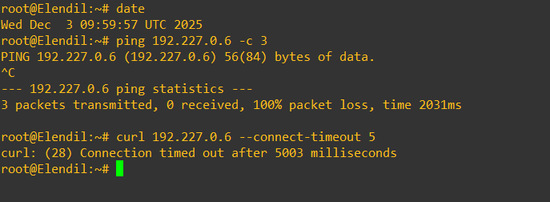

Go to Palantir:

Lihat 10 baris terakhir log sistem

```dmesg | tail or dmesg | grep "PORT_SCAN"```

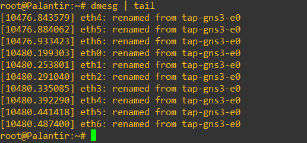

### Soal 7:
Mengatur pembatasan akses ke server IronHills agar hanya 3 koneksi aktif per IP yang diizinkan dalam waktu bersamaan.

In Elendil/or any Client node:
```
apt-get update
apt-get install apache2-utils -y
```

In IronHills:

Note:
- Kalau mau digabung dengan rules sebelumnya, letakkan aturan ini PALING ATAS.
- Pasang aturan limit koneksi di baris paling atas (INPUT 1)
- Jika koneksi TCP ke port 80 lebih dari 3, langsung REJECT.

```
iptables -I INPUT 1 -p tcp --syn --dport 80 -m connlimit --connlimit-above 3 -j REJECT
```

Testing:

In Elendil/or any Client node:

a) Lakukan tes dengan Apache Benchmark

b) Kirim 50 request, dengan 10 koneksi berbarengan (Concurrency = 10)
```
ab -n 100 -c 10 http://192.227.0.30/
```

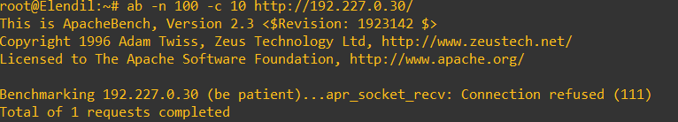

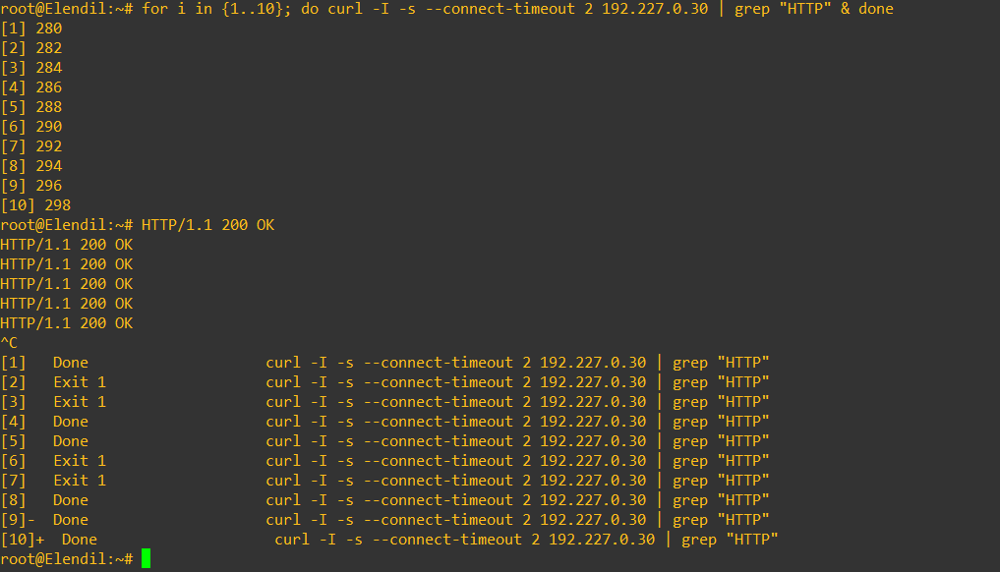

#### Cara Baca Output:
a) Cari baris "Failed requests".
b) Jika angkanya > 0 (misal 50-90), berarti BERHASIL (Firewall menolak kelebihan koneksi).
c) Jika 0, berarti gagal (semua lolos).

### Soal 8:

Menyimulasikan dan memverifikasi pengalihan (redirect) trafik yang seharusnya dikirim dari Vilya (DHCP server) ke Khamul (target client), tetapi justru diarahkan ke IronHills (web server).

In Wilderland:

#### ATURAN 1: SIHIR PENGALIHAN (DNAT)

Kalau ada paket dari Vilya (SRC) mau ke Khamul (DST), BELOKKAN ke IronHills."

##### IP Vilya: 192.227.0.34
##### IP Khamul (Target Asli): 192.227.0.42
##### IP IronHills (Target Palsu): 192.227.0.30

```iptables -t nat -A PREROUTING -s 192.227.0.34 -d 192.227.0.42 -j DNAT --to-destination 192.227.0.30```

#### ATURAN 2: PASANG TOPENG (SNAT) - SOLUSI TIMEOUT

"Kalau ada paket dari Vilya yang menuju IronHills (hasil belokan tadi), GANTI nama pengirimnya jadi Saya (Wilderland)."

##### IP Wilderland (arah Moria): 192.227.0.26

```iptables -t nat -A POSTROUTING -s 192.227.0.34 -d 192.227.0.30 -j SNAT --to-source 192.227.0.26```

##### ATURAN 3: IZINKAN BALIKAN JAWABAN DARI IRONHILLS KE VILYA

"Kalau ada paket balasan dari IronHills ke Saya (Wilderland), IZINKAN paket itu untuk diteruskan ke Vilya." Karena rules sebelumnya.

```iptables -I INPUT 1 -p tcp --dport 80 -s 192.227.0.26 -j ACCEPT```

#### Untuk bersih-bersih tabel NAT dulu (kalo ada rules bertabrakan)
```iptables -t nat -F```

Testing:

From Vilya, coba:

a) Logika Testing:

- Khamul (Target Asli): Adalah Client biasa. Biasanya tidak menjalankan Web Server (Port 80 tertutup).
- IronHills (Target Pembelokan): Adalah Web Server. Port 80 terbuka.

Jadi, jika Vilya mencoba connect ke Khamul di port 80 dan BERHASIL, itu bukti kuat bahwa dia sebenarnya nyasar ke IronHills.

#### Vilya mencoba menyapa Khamul di port 80
```nc -v -z 192.227.0.42 80```

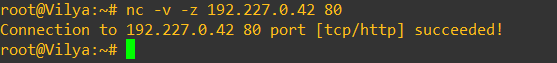

## Misi 3: Isolasi Sang Nazgûl
### Soal 1:

Memblokir seluruh lalu lintas masuk dan keluar dari Khamul (5 Host) dan memastikan bahwa Khamul terisolasi total, sementara Durin (50 Host) tetap dapat berkomunikasi.

In Wilderland:

1. Blokir paket YANG KELUAR DARI Khamul (Source = Subnet Khamul)
 
##### Gunakan -I FORWARD 1 agar aturan ini ditaruh paling atas (Prioritas Tertinggi)

```
iptables -I FORWARD 1 -s 192.227.0.40/29 -j DROP
```

##### 2. Blokir paket YANG MENUJU KE Khamul (Destination = Subnet Khamul)

```iptables -I FORWARD 1 -d 192.227.0.40/29 -j DROP```

Testing:

From khamul

1. Ping ke Internet (Gagal)
   
```ping 8.8.8.8 -c 3```

2. Ping ke Tetangga (Durin - 192.227.0.66) (Gagal)

```ping 192.227.0.66 -c 3```
3. Akses Web Server (Gagal)

```curl 192.227.0.30 --connect-timeout 5```

From outside (Vilya / Elendil)

1. Ping ke IP Khamul (192.227.0.42)

```ping 192.227.0.42 -c 3```

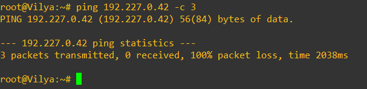

In Durin:

1. Durin ping ke Google
```ping 8.8.8.8 -c 3```
